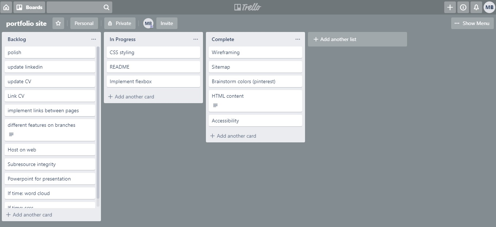

# Mark Ball Portfolio Website - T1A3

Website: https://focused-agnesi-f7e763.netlify.com/

Github: https://github.com/Mark-Ball/portfolio-site

# Purpose

The purpose of the portfolio website is to present my skills, interests, and work history to potential employers and collaborators. This will enhance my visibility to others in the technology industry, which will assist in gaining employment or becoming involved with interesting projects.

As a developer, the website itself functions as an exhibition of software development and design capabilities. Therefore extra attention has been paid to designs which address modern concerns. These concerns include responsiveness to screens of different sizes, interactivity to encourage visitors to return to the site, and accessibility for the visually impaired.

# Functionality and Features

### A Consistent Style

All webpages use a consistent style, including components, fonts, colours, and themes:

- The navigation bar, the banners with the name of the webpage, and the buttons to LinkedIn and Github are components which are on every page of the website.
- The Poppins font is used for headers and Rubik is used for other text such as paragraphs. These sans-serif fonts were selected for their legibility and modern appearance.
- The colour scheme of the website is blue and grey with heavy use of whitespace.
- Use of futuristic imagery in the banners of each page provide a unifying theme and appears futuristic. All fractal images were tinted blue to conform to the colour theme of the website.

### Semantic HTML

HTML elements have been named to enhance the readability of the code. For example, HTML tags such as nav, p, and footer have been used and comments have been added to the HTML document to describe the meaning of each block of code.

Additionally, the classes and id's used in CSS have been named in a way which is intended to enhance readability. For example the class 'flex-centered' includes the name 'flex' because it creates a flexbox using display: flex, and it centers the content which is childed to it using justify-content: center and align-items: center.

### Navigation and footer bars

The site will include a navigation bar, which will include links to the other main pages of the website - home, projects, blog, and CV - on each page. The navigation bar both informs visitors of the other pages available on the website, and allows them a way to visit them.

A footer bar will be included with links to professional accounts - LinkedIn and Github - as well as a link which will open an email message to my email address. This will allow visitors to view additional information such as my career prior to tech, personal projects, and allow them to get in contact with me if they wish.

### Responsive Design

As visitors to the site may use a multitude of devices, the website has been designed to function well on screens of different sizes. 

This has been accomplished by the use of CSS Flexbox, which allows control over the positioning of elements in response to a change in screen size. The website is designed to display correctly on a device as small as an iPhone 5/SE, which has a width of 320 pixels. When the screen width is over 1100 pixels, the elements of the website no longer expand to fill the space, instead leaving whitespace on the left and right of the screen.

By checking that components are displaying correctly on the smallest smartphones and wide screens such as desktop monitors, the website is viewable by the widest audience.

### CV download

Visitors to the website will have the ability to download a PDF copy of my CV. This will allow them to incorporate my information into their file systems or show other relevant persons without needing to visit the website repeatedly.

### Accessibility

Attention has been paid to the ability of visually-impaired individuals to use the website. This takes the form of providing alt-text for any images on the page, and ensuring that the contrast between elements on the page is high and does not use a colour scheme which would be a problem for color-blind visitors (e.g. red-green colour-blindness).

Acessibility was checked using the Audit function built into the Google Chrome developer tools. Separate audits were conducted for all four webpages. Audit scores of 100 were attained for all webpages.

### Three Versions

Three versions of the website have been produced and saved on different branches in Github. The versions are as follows:

- 'master' branch with the base version
- 'dark' branch with a version with a dark colour scheme
- 'no-graphics' branch with the banner graphics removed

### Subresource integrity

Subresource integrity ensures that the files delivered to your web application do not have any unexpected content such as malicious code injected by a third party.

Subresource integrity has been achieved by creating a hash using sha512 and using this hash as the value of the integrity attribute of our link tag. 

# Sitemap

The website simply has all pages link to each other via the navigation bar. As more pages are added, for example when more projects are added, each will be moved to their own page. However, given the fact that the website only has four pages, it is feasible for each page to link to each other page.

# Screenshots

# Target audience

The target audience for the website falls into two categories, which may overlap:

1. Employers
2. Project Leads

The website is intended as a showcase of my abilities as a software developer and designer. The most likely use of the website is to link alongside a traditional application for employment as evidence of ability. Additionally, employers or those leading other projects may chance upon the website and consider me for employment or inclusion in their projects.

# Tech stack

- HTML is used for the content of all webpages
- CSS is used for the styling and positioning of elements.
- Netlify is used for web-hosting.

# Project Management

Trello was used to track the progress of tasks within the project. A series of screenshots representing a timeline of the project is provided below.

##### Day 1 start (17/09/2019)

##### Day 2 start (18/09/2019)

##### Day 4 start (20/09/2019)

##### Day 5 start (21/09/2019)
